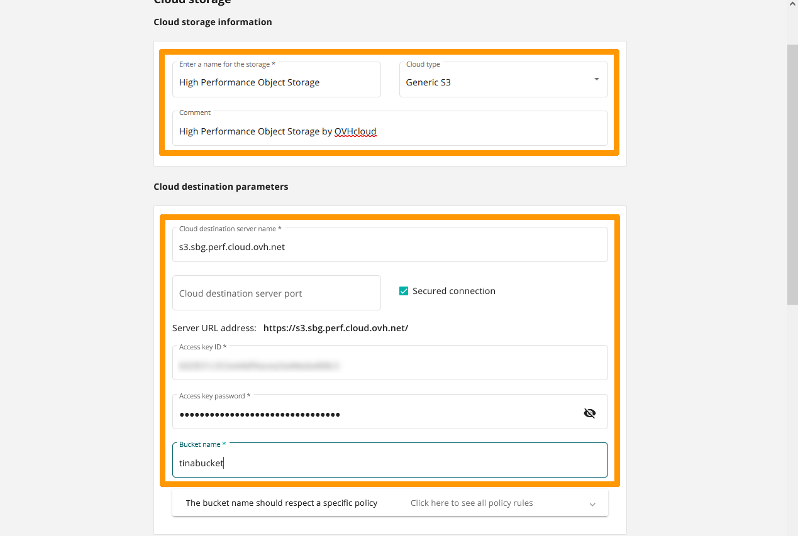

**Dernière mise à jour le 23/08/2022**

## Objectif

Ce guide a pour objectif de vous montrer comment configurer Tina pour utiliser votre espace de stockage High Perf Object Storage.

> [!warning]
>
> OVHcloud met à votre disposition des services dont la configuration, la gestion et la responsabilité vous incombent. Il vous revient de ce fait d'en assurer le bon fonctionnement.
>
> Nous mettons à votre disposition ce guide afin de vous accompagner au mieux sur des tâches courantes. Néanmoins, nous vous recommandons de faire appel à un [prestataire spécialisé](https://partner.ovhcloud.com/fr/) et/ou de contacter l'éditeur du logiciel si vous éprouvez des difficultés. En effet, nous ne serons pas en mesure de vous fournir une assistance. Plus d'informations dans la section « Aller plus loin » de ce guide.
>
> La licence Tina n’est pas fournie par OVHcloud. Pour plus d’informations, contactez le service commercial d'Atempo ou d’OVHcloud.
>

## Prérequis

- Avoir créé un bucket.
- Avoir créé un utilisateur et avoir défini les droits d'accès requis sur le bucket.
- Connaître vos informations d'identification S3 (access_key et secret_access_key).
- Utiliser une solution de sauvegarde [Tina](https://www.atempo.com/fr/produits/tina-atempo-time-navigator-sauvegarde-d-entreprise-complete/).


Consultez notre guide « [Débuter avec S3 Object Storage](https://docs.ovh.com/fr/storage/s3/debuter-avec-s3/) » pour plus de détails.

## En pratique

Nous allons configurer un stockage **High Performance Object Storage** avec le logiciel de sauvegarde **Tina** en tant que dépôt pour certains agents de sauvegardes **Tina**, vous pouvez consultez ce lien pour vérifier la compatibilité [Guide de compatibilité Tina 2022](https://www.atempo.com/wp-content/uploads/2022/01/COMPATIBILITY-GUIDE_en_Tina_469_24-01-2022.pdf) avec les agents de sauvegarde.

### Activation de la gestion des versions sur le bucket S3

Pour pouvoir utiliser **High Performance Object Storage** comme solution de stockage pour **Tina** il est nécessaire d'activer la gestion des versions sur le *bucket*. 

Utilisez cette commande qui fait partie des outils **Awscli** pour activer la gestion des versions sur le bucket **tinabucket** qui se trouve à Strasbourg :

```bash
aws s3api put-bucket-versioning --bucket tinabucket --versioning-configuration Status=Enabled --endpoint=https://s3.sbg.perf.cloud.ovh.net
```

### Ajout du stockage HighPerformance Object Storage sur le serveur **Tina****

Au travers de la console d'administration de **Tina** choisissez à gauche `Backup`{.action} ensuite cliquez sur `Storage`{.action}.

{.thumbnail}

Cliquez sur `Add new storage`{.action}.

{.thumbnail}

Choisisssez `cloud storage`{.action} et cliquez sur `Next`{.action}.

{.thumbnail}

Saisissez ces valeurs pour **Cloud storage information** :

- **Enter a name for storage** : `High Performance Object Storage`.
- **Cloud type** : `Generic S3`.
- **Comment** : `High Performance Object Storage by OVHcloud`.

Ensuite modifiez les informations concernant **Cloud destination parameters** :

- **Cloud destination server name** : `s3.sbg.perf.cloud.ovh.net`.
- **Secured connection** : `coché`.
- **Access key ID** : `clé du bucket`.
- **Access key password** : `mot de passe correspondant à la clé`.
- **Bucket name** : `tinabucker`.

Faites `défiler la fenêtre`{.action}. 

{.thumbnail}

Activez `Define a primary data retention pool`{.action} et choisissez ces options :

- **Retention** : `Infinite`.
- **Storage pool name** : `HighPerformanceObjectStorage`.

Cliquez sur `FINISH`{.action}. 

{.thumbnail}

Le nouveau stockage apparait.

{.thumbnail}

CLiquez sur `Backup`{.action}, ensuite cliquez sur `Pools & cartriges`{.action}.

{.thumbnail}

Le pool de rétention est créé et est utilisable pour une destination lors de la configuration d'un agent de sauvegarde.

{.thumbnail}

## Aller plus loin

Échangez avec notre communauté d'utilisateurs sur [https://community.ovh.com](https://community.ovh.com){.external}.

[Page d'accueil Atempo](https://www.atempo.com)

[Guide de compatibilité Tina 2022](https://www.atempo.com/wp-content/uploads/2022/01/COMPATIBILITY-GUIDE_en_Tina_469_24-01-2022.pdf)