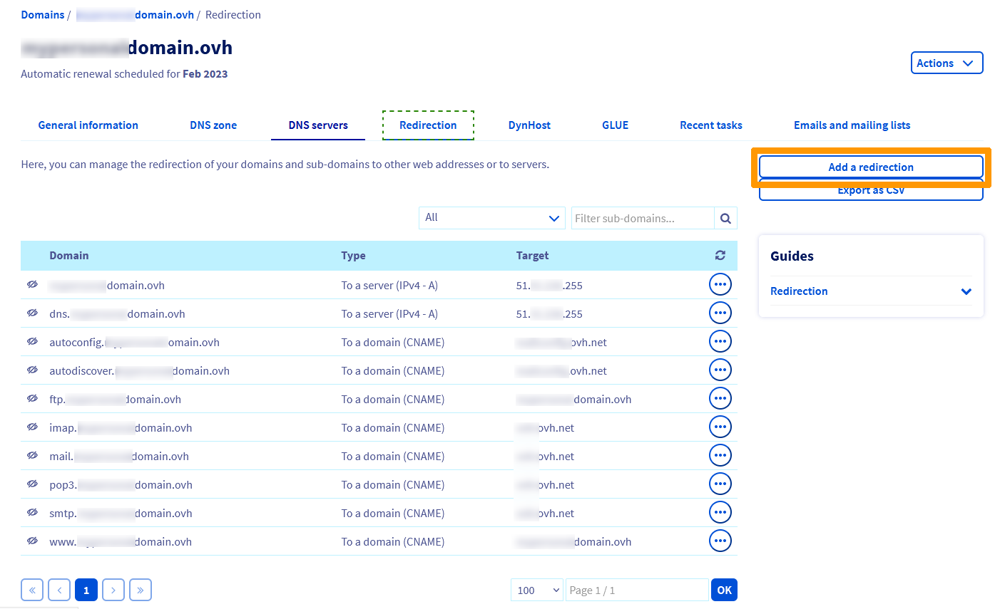

**Dernière mise à jour le 15/09/2022**

## Objectif

La redirection de nom de domaine permet de renvoyer celui-ci vers une nouvelle cible. Il existe différents types de redirections.

**Découvrez différentes manières de rediriger votre nom de domaine**

## Prérequis

- Disposer d'un [nom de domaine](https://www.ovhcloud.com/fr/domains/)
- Être connecté à votre [espace client OVHcloud](https://www.ovh.com/auth/?action=gotomanager&from=https://www.ovh.com/fr/&ovhSubsidiary=fr){.external}.
- Être connecté à votre hébergement web (pour une redirection via un fichier [".htaccess"](#htaccess_Rewrite)).

## En pratique

### Comprendre la redirection d'un nom de domaine

Cette fonctionnalité permet de rediriger un domaine/sous-domaine vers :

- un autre domaine/sous-domaine déjà existant :
**Exemple** : domain.tld
- une URL (Uniform Resource Locator) de site internet :
**Exemples** : http://www.domain.tld/welcome/ ou https://www.domain.tld/welcome/ (si le domaine cible dispose d'un certificat SSL compatible).

Ces actions peuvent être réalisées de plusieurs manières :

- **depuis l'[espace client OVHcloud](https://www.ovh.com/auth/?action=gotomanager&from=https://www.ovh.com/fr/&ovhSubsidiary=fr)** : un assistant de configuration permet de paramétrer votre redirection
- **depuis une méthode nécessitant de la programmation** : vous devrez créer vous-même la redirection dans un fichier (généralement un [".htaccess"](#htaccess_Rewrite)).

> [!warning]
>
> La mise en place d'une redirection peut avoir des conséquences sur le référencement de votre site internet. 
> Soyez vigilant quant aux manipulations que vous allez entreprendre ou contactez un [prestataire spécialisé](https://partner.ovhcloud.com/fr/) dans le référencement si nécessaire.
>

### Rediriger un nom de domaine via l'espace client

Connectez-vous à votre [espace client OVHcloud](https://www.ovh.com/auth/?action=gotomanager&from=https://www.ovh.com/fr/&ovhSubsidiary=fr){.external}, rendez-vous dans la partie `Web Cloud`{.action}, sélectionnez le domaine à rediriger dans la section `Noms de domaine`{.action}, puis cliquez sur l'onglet `Redirection`{.action}.

Le tableau affiche les redirections actives pour votre nom de domaine. Vous pouvez y gérer vos redirections existantes à l'aide des boutons `...`{.action} situés à droite de chaque lignes.

Pour ajouter une redirection, cliquez sur `Ajouter une redirection`{.action} :

{.thumbnail}

Il y a trois options de redirections disponibles depuis l'[espace client OVHcloud](https://www.ovh.com/auth/?action=gotomanager&from=https://www.ovh.com/fr/&ovhSubsidiary=fr) et chacune d'entres-elles se fait en **5 étapes**. 

> [!primary]
>
> L'onglet `Redirection`{.action} dispose d'une quatrième option permettant de faire pointer rapidement votre domaine vers les entrées DNS A, AAAA et CNAME. Du fait qu'il ne s'agit pas là à proprement parlé de redirections, cette option ne sera pas détaillée dans ce guide. Pour plus d'informations sur les entrées DNS, consultez notre documentation sur les [enregistrements DNS](https://docs.ovh.com/fr/domains/editer-ma-zone-dns/#les-enregistrements-dns).
>

Retrouvez ci-après les trois types de redirection détaillés étape par étape :

#### **Option 1 : redirection visible permanente vers une adresse web** :

Lorsque vous saisissez le domaine à rediriger, cette redirection permet d'afficher le domaine cible dans la barre d'URL de votre navigateur internet à la place du domaine saisie. 

Cette redirection, dite « permanente », présente un intérêt lorsque vous souhaitez basculer le référencement du nom de domaine d'origine vers le nom de domaine cible. Alors votre nom de domaine cible sera mieux positionné sur un moteur de recherche.

**Exemple** : si vous redirigez *domaine1.tld* vers *domaine2.tld*, c'est *domaine2.tld* qui s'affichera dans la barre d'URL dans votre navigateur.

{.thumbnail}

> Cette redirection « standard » retournera un code HTTP 301.

> [!tabs]
> **Etape 1**
>>
>> Dans la fenêtre, votre domaine à rediriger apparaît déjà. Renseignez **seulement** le formulaire si vous souhaitez rediriger un *sous-domaine*.
>>
>> La case `Rediriger aussi`{.action} peut être cochée pour rediriger également votre sous-domaine en *"www"* vers la même cible que vous choisirez pour votre domaine ou sous-domaine.
>>
>> {.thumbnail}
>>
>> Cliquez sur `Suivant`{.action}, puis passez à l'étape 2.
>>
> **Etape 2**
>>
>> Sélectionnez `Vers une adresse Web`{.action}.
>>
>> {.thumbnail}
>>
>> Cliquez sur `Suivant`{.action}, puis passez à l'étape 3.
>>
> **Etape 3**
>>
>> Sélectionnez `avec une redirection visible.`{.action}.
>>
>> {.thumbnail}
>>
>> Cliquez sur `Suivant`{.action}, puis passez à l'étape 4.
>>
> **Etape 4**
>>
>> Sélectionnez `Permanente (301) :`{.action} puis saisissez le domaine ou l'URL cible de votre redirection dans le formulaire `Adresse web`{.action} qui s'affiche.
>>
>> {.thumbnail}
>>
>> Cliquez sur `Suivant`{.action}, puis passez à l'étape 5.
>>
> **Etape 5**
>>
>> Dans cette dernière étape, assurez-vous que les informations affichées soient bien correctes.
>>
>> {.thumbnail}
>>
>> Cliquez sur `Confirmer`{.action} pour valider votre configuration.
>> 
>> > [!primary]
>> >
>> > Si le message **"Il existe des redirections à partir des domaines que vous souhaitez rediriger qui entrent en conflit avec les redirections que vous souhaitez ajouter"** s'affiche, vous pouvez cocher la case *Confirmer l'écrasement de la redirection existante* pour forcer l'application de votre redirection. Cela modifiera la zone DNS de votre nom de domaine.
>> >
>> > Attention, l'ancienne configuration sera donc désactivée et supprimée.
>> >
>>

#### **Option 2 : redirection visible temporaire vers une adresse web** :

Lorsque vous saisissez le domaine à rediriger, cette redirection permet d'afficher le domaine cible dans la barre d'URL de votre navigateur internet à la place du domaine saisie.

Cette redirection dite « temporaire » est à utiliser, par exemple, pour un événement éphémère. Votre nom de domaine d'origine conservera sa position dans un moteur de recherche tandis que le nom de domaine cible ne sera pas visible dans celui-ci.

**Exemple** : si vous redirigez *domaine1.tld* vers *domaine2.tld*, c'est *domaine2.tld* qui s'affichera dans la barre d'URL dans votre navigateur.

{.thumbnail}

> Cette redirection retournera un code HTTP 302.

> [!tabs]
> **Etape 1**
>>
>> Dans la fenêtre, votre domaine à rediriger apparaît déjà. Renseignez **seulement**  le formulaire si vous souhaitez rediriger un *sous-domaine*.
>>
>> La case `Rediriger aussi`{.action} peut être cochée pour rediriger également votre sous-domaine en *"www"* vers la même cible que vous choisirez pour votre domaine ou sous-domaine.
>>
>> {.thumbnail}
>>
>> Cliquez sur `Suivant`{.action}, puis passez à l'étape 2.
>>
> **Etape 2**
>>
>> Sélectionnez `Vers une adresse Web`{.action}.
>>
>> {.thumbnail}
>>
>> Cliquez sur `Suivant`{.action}, puis passez à l'étape 3.
>>
> **Etape 3**
>>
>> Sélectionnez `avec une redirection visible.`{.action}.
>>
>> {.thumbnail}
>>
>> Cliquez sur `Suivant`{.action}, puis passez à l'étape 4.
>>
> **Etape 4**
>>
>> Sélectionnez `Temporaire (302) :`{.action} puis saisissez le domaine ou l'URL cible de votre redirection dans le formulaire `Adresse web`{.action} qui s'affiche.
>>
>> {.thumbnail}
>>
>> Cliquez sur `Suivant`{.action}, puis passez à l'étape 5.
>>
> **Etape 5**
>>
>> Dans cette dernière étape, assurez-vous que les informations affichées soient bien correctes.
>>
>> {.thumbnail}
>>
>> Cliquez sur `Confirmer`{.action} pour valider votre configuration.
>> 
>> > [!primary]
>> >
>> > Si le message **"Il existe des redirections à partir des domaines que vous souhaitez rediriger qui entrent en conflit avec les redirections que vous souhaitez ajouter"** s'affiche, vous pouvez cocher la case *Confirmer l'écrasement de la redirection existante* pour forcer l'application de votre redirection. Cela modifiera la zone DNS de votre nom de domaine.
>> >
>> > Attention, l'ancienne configuration sera donc désactivée et supprimée.
>> >
>>

#### **Option 3 : redirection invisible vers une adresse web** :

Lorsque vous saisissez le nom de domaine à rediriger, son URL sera conservée dans la barre d'adresse de votre navigateur internet, mais c'est le contenu du nom de domaine cible qui sera affiché. <br> **Attention, cette action n'est pas compatible avec tous les sites et affecte le référencement de ce dernier**.

**Exemple** : si vous redirigez *domain1.tld* vers *domain2.tld*, c'est *domain1.tld* qui s'affichera dans la barre d'URL dans votre navigateur et le contenu du site *domain2.tld*.

{.thumbnail}

La redirection invisible fonctionne avec une balise HTML *iFrame*. Celle-ci permet à votre domaine redirigé d'intégrer dans sa propre page HTML le contenu de l'autre page du domaine cible.

Cette encapsulation permet de s'assurer que les visiteurs de votre site ne puissent pas être en mesure de visualiser le domaine cible.

> Cette option retournera un code HTTP 200.

> [!warning]
>
> Attention, les pages encapsulées avec une balise *iFrame* peuvent ne pas être lues sur les smartphones  et ne sont pas compatibles avec tous les sites. Leurs contenus n'est généralement pas pris en compte par les moteurs de recherche pour le référencement et l'indexation de votre site.
>

> [!tabs]
> **Etape 1**
>>
>> Dans la fenêtre, votre domaine à rediriger apparaît déjà. Renseignez **seulement** le formulaire si vous souhaitez rediriger un *sous-domaine*.
>>
>> La case `Rediriger aussi`{.action} peut être cochée pour rediriger également votre sous-domaine en *"www"* vers la même cible que vous choisirez pour votre domaine ou sous-domaine.
>>
>> {.thumbnail}
>>
>> Cliquez sur `Suivant`{.action}, puis passez à l'étape 2.
>>
> **Etape 2**
>>
>> Sélectionnez `Vers une adresse Web`{.action}.
>>
>> {.thumbnail}
>>
>> Cliquez sur `Suivant`{.action}, puis passez à l'étape 3.
>>
> **Etape 3**
>>
>> Sélectionnez `avec une redirection invisible.`{.action}.
>>
>> {.thumbnail}
>>
>> Cliquez sur `Suivant`{.action}, puis passez à l'étape 4.
>>
> **Etape 4**
>>
>> Sélectionnez `Temporaire (iframe) :`{.action} puis saisissez le domaine ou l'URL cible de votre redirection dans le formulaire `Adresse web`{.action} qui s'affiche.
>>
>> {.thumbnail}
>>
>> Trois paramètres optionnels peuvent être saisis dans cette étape :<br>
>> - **Titre** : Celui de votre site web. Il s'affichera en tant que titre de page dans l'onglet des navigateurs internet.<br>
>> - **Mots clés** : Peuvent être utilisés par les moteurs de recherche pour partiellement référencer la page.<br>
>> - **Description** : Concerne votre site web. Elle sera utilisée par les moteurs de recherche dans leurs résultats.
>>
>> Cliquez sur `Suivant`{.action}, puis passez à l'étape 5.
>>
> **Etape 5**
>>
>> Dans cette dernière étape, vérifiez les informations saisies.
>>
>> {.thumbnail}
>>
>> Cliquez sur `Confirmer`{.action} pour valider votre configuration.
>> 
>> > [!primary]
>> >
>> > Si le message **"Il existe des redirections à partir des domaines que vous souhaitez rediriger qui entrent en conflit avec les redirections que vous souhaitez ajouter"** s'affiche, vous pouvez cocher la case *Confirmer l'écrasement de la redirection existante* pour forcer l'application de votre redirection. Cela modifiera la zone DNS de votre nom de domaine.
>> >
>> > Attention, l'ancienne configuration sera donc désactivée et supprimée.
>> >
>>

> [!primary]
>
> Quelle que soit la redirection choisie, la modification nécessite un temps de propagation de 4 à 24 heures maximum avant d’être pleinement effective.
>

### Rediriger un nom de domaine via un fichier ".htaccess" <a name="htaccess_Rewrite"></a>

> [!warning]
>
> OVHcloud met à votre disposition des services dont la configuration, la gestion et la responsabilité vous incombent. Il vous revient de ce fait d'en assurer le bon fonctionnement.
> 
> Nous mettons à votre disposition cette partie du guide afin de vous accompagner au mieux sur des tâches courantes. Néanmoins, nous vous recommandons de faire appel à un [prestataire spécialisé](https://partner.ovhcloud.com/fr/) si vous éprouvez des difficultés. En effet, nous ne serons pas en mesure de vous fournir une assistance sur ce qui va suivre. Plus d'informations dans la section [« Aller plus loin »](#go-further) de ce guide.
>

Les fichiers de configuration ".htaccess" peuvent intégrer des commandes spécifiques. Lors de l’exécution du code de votre site web par le serveur web (Apache), ces commandes seront interprétées et ainsi exécutées. Parmi celles-ci, il est possible de créer des redirections.

Manipuler un fichier ".htaccess" peut rendre innaccessible vos sites. En cas de doute, contactez un [prestataire spécialisé](https://partner.ovhcloud.com/fr/) .

Vous pouvez retrouver l'ensemble de notre documentation sur le ".htaccess" dans la section [« Aller plus loin »](#go-further) de ce guide.

> [!primary]
>
> Nous vous conseillons de **réaliser une sauvegarde de votre fichier .htaccess** avant de le modifier pour revenir à la version antérieure si besoin.
>

Vous trouverez ci-dessous 4 variables pour mettre en place des redirections via le fichier ".htaccess" :

- **1 : "Redirect permanent"**

Permet de rediriger un site dans son ensemble ou seulement une partie vers un autre site ou une autre partie d'un site. Les visiteurs sont alors automatiquement redirigés vers la bonne adresse/URL lorsqu'ils tentent d'accéder à votre site avec l'adresse/URL historique.

> [!tabs]
> Code à placer dans le ".htaccess"
>>
>> Pour rediriger un site en entier :
>>
>>```bash
>>Redirect permanent / http://domainTarget.tld/
>>```
>>
>> Pour rediriger d'un répertoire vers un autre :
>>
>> ```bash
>>Redirect permanent /old_folder http://domain.tld/new_folder
>>```
>>
>> Pour rediriger d'un fichier vers un autre :
>>
>> ```bash
>>Redirect permanent /old_file.php http://domain.tld/new_file.php
>>```
>>
> Code HTTP
>>
>> Le script renverra un code HTTP 301. Cela préviendra les robots des moteurs de recherche qu'il faut mettre à jour leurs liens vers la nouvelle adresse/URL.
>>

- **2 : "Redirect gone"** :

Utile pour les fichiers supprimés, remplace le message *404 document non trouvé* par un message plus explicite de type *410 le document n’existe plus*. Le visiteur de votre site est informé que le fichier qu'il tente d'appeler n'existe plus.

> [!tabs]
> Code à placer dans le ".htaccess"
>>
>>```bash
>>Redirect gone /fileDeleted.html
>>```
>>
> Code HTTP
>>
>> Le script renverra un code HTTP 410.
>>

- **3 : "Redirect seeother"**

Si vous changez l’extension d’un fichier, *seeother* permet d'en modifier le type. Le visiteur qui accédait à l'ancien fichier sera automatiquement redirigé vers celui avec la bonne extension.

> [!tabs]
> Code à placer dans le ".htaccess"
>>
>>```bash
>>Redirect seeother /example.doc http://domain.tld/example.pdf
>>```
>>
> Code HTTP
>>
>> Le script renverra un code HTTP 303.
>>

- **4 : "Redirect Temp"**

Peut être utilisée lorsque vous déplacez temporairement des fichiers sur un autre site. Les visiteurs qui tentent d'accéder à votre site via l'adresse/URL historique sont automatiquement redirigés vers la nouvelle adresse/URL temporaire.

> [!tabs]
> Code à placer dans le ".htaccess"
>>
>>```bash
>>Redirect temp / http://OtherWebsite.tld/site/
>>```
>>
> Code HTTP
>>
>> Le script renverra un code HTTP 302.
>>

## Aller plus loin <a name="go-further"></a>

[Bloquer l’accès à mon site pour certaines adresses IP via un fichier ".htaccess"](https://docs.ovh.com/fr/hosting/mutualise-htaccess-comment-bloquer-certaines-ip-au-niveau-de-mon-site/).

[Protéger l'interface d'administration de votre site via le ".htaccess"](https://docs.ovh.com/fr/hosting/mutualise-htaccess-comment-proteger-lacces-a-un-repertoire-par-une-authentification/).

[Réécrire vos URLs grâce au « mod_rewrite »](https://docs.ovh.com/fr/hosting/htaccess-reecriture-url-mod-rewrite/).

[Effectuer d'autres opérations avec le fichier ".htaccess"](https://docs.ovh.com/fr/hosting/mutualise-htaccess-les-autres-operations-realisables-avec-des-fichiers-htaccess/).

[Comment éditer ma zone DNS ?](https://docs.ovh.com/fr/domains/editer-ma-zone-dns/)

Pour des prestations spécialisées (référencement, développement, etc), contactez les [partenaires OVHcloud](https://partner.ovhcloud.com/fr/).

Si vous souhaitez bénéficier d'une assistance à l'usage et à la configuration de vos solutions OVHcloud, nous vous proposons de consulter nos différentes [offres de support](https://www.ovhcloud.com/fr/support-levels/).

Échangez avec notre communauté d'utilisateurs sur <https://community.ovh.com>.